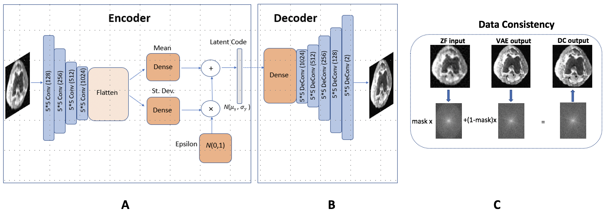

# GAN-Hallucination

## Background
Reliable MRI is crucial for accurate interpretation in therapeutic and diagnostic tasks. However, undersampling during MRI acquisition as well as the use of deep learning (DL) methods introduces uncertainty that can lead to incorrect diagnoses and poor patient outcomes. This code allows one to produce realistic and data-consistent MR image reconstructions using a VAE model.

After training and evaluating the VAE model, its generative capabilities can be harnessed to produce new reconstructions that can be evaluated with a Monte Carlo approach to assess pixel-wise variance or other statistics. Additionally, the trace of the end-to-end network Jacobian is calculated to aid in the computation of Stein's Unbiased Risk Estimator (SURE), which enables the quantification of risk even when the ground truth image is unknown.

## Data
In training the model, we use a Knee dataset obtained from patients at Stanford Hospital. Fully sampled images of size 320 by 256 are taken, downsampled, and then undersampled to serve as inputs to the VAE model.

## Model Architecture
The model architecture is shown below, with the VAE (encoder and decoder layers are comprised of strided and transpose convolutions, respectively) and a data consistency layer (affine projection). When adversarial loss is used, we use a Convnet to serve as the discriminator.

  

## Command to Run From Terminal

python3 srez_main.py 
--run train 
--dataset_train ../GAN-Hallucination/Data/Knee-highresolution-19cases/train
--dataset_test ../GAN-Hallucination/Data/Knee-highresolution-19cases/test/ 
--sampling_pattern ../GAN-Hallucination/Data/Knee-highresolution-19cases/sampling_pattern/mask_5fold_160_128_knee_vdrad.mat 
--sample_size 128 
--sample_size_y 160 
--batch_size 4 
--summary_period 200 
--sample_test -1 
--sample_train -1 
--subsample_test -1
--subsample_train -1 
--train_time 150 
--train_dir train/ 
--checkpoint_dir checkpoints/ 
--tensorboard_dir tensorboard/ 
--gpu_memory_fraction 1.0 
--hybrid_disc 0 
--starting_batch 0
